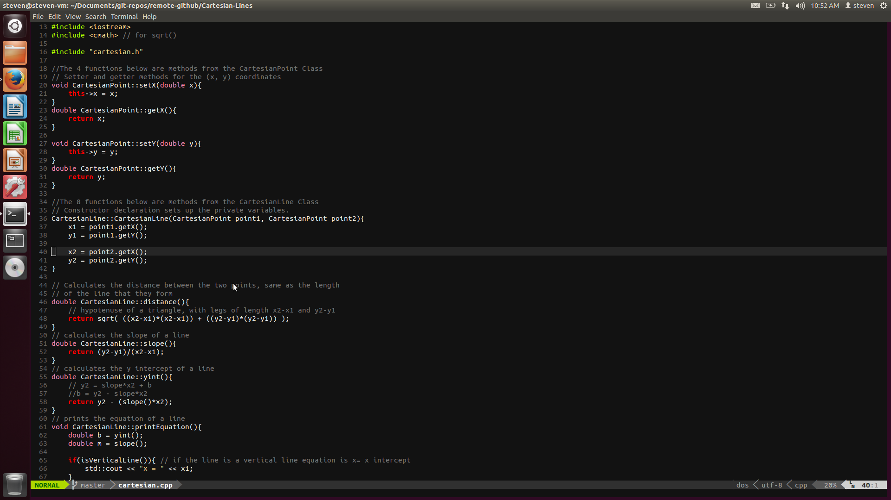
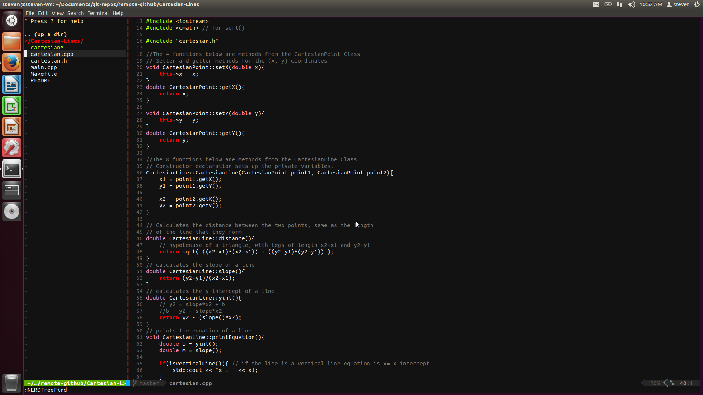

#Dotfiles





  This is a repo of the dot files that I use and have modifications for.

###Usage
  To use everything in this repo, just run the following command:

####Initial Setup

Note that git needs to be installed in order to do this setup. Install git with:

```bash
sudo apt-get install git
```

Then do these for the initial setup:

```bash
$ cd ~
$ git clone https://github.com/hallzy/dotfiles.git
$ dotfiles/move-files-from-dotfiles-to-home
$ .auto-install-programs/install-programs

#Optional
$ .auto-clone/clone-repos
$ ./update-vim-plugins

$ ./create-sym-links-for-myscripts
$ custom-fortunes/install-quote

$ ./setup-latex-resume-font
```

The steps that are optional are optional because it is not necessary to clone
the repos. The repos that are used to update the vim plugins will be updated
with a git pull anyways, since I will maintain that myself.

This will clone the repository to your home folder. All the files in this repo
will be put into a folder called dotfiles which is in the home folder.

The script that runs as the 3rd step above moves all the files and folders from the
dotfiles folder and into the home folder, and then removes the dotfiles folder
for you.

The 3rd entry will install all the programs in the
.auto-install-programs/programs-to-install file.

The 4th entry will automatically clone all of the repos that I use or own.

The 5th Entry will pull new changes from the repos I use for my vim plugins and
then copy those changes to my .vim directory.

The 6th step runs a script that creates symbolic links in your /bin
folder for scripts that are in ~/.my-scripts.

The 7th step will add the files in the categories subfolder to the fortunes game
program.

The 8th step will put the fonts in all the right places to use the latex resume.


####Update Your Local Repo

The following command will pull those changes for you and update your home folder:

```bash
$ update-home-folder
```

This will pull the latest change from the repo and create symbolic links for any
new scripts that have been added to ~/.my-scripts, update the fortunes program
categories, and the .vim folder will be updated.

If you did not run the optional commands for the initial setup, This script will
not update the vim folder.

If you run:

```bash
$ update-home-folder install
```

It will do the same as above, except it will also perform the program install
process.


###.vim and .vimrc
  This includes my .vimrc file which is  modified version of the .vimrc
file from [mscoutermarsh](https://github.com/mscoutermarsh)

  I also recommend remapping the caps lock key to esc, since the escape key is
used quite frequently using vim, or remembering that ctrl+\[ is is recognized
as the escape key (this may be a better option for virtual machines, or windows
users as remapping keys in windows or with a vm is a little annoying. Remapping
keys in Ubuntu for example, is much easier).

###.bashrc
  Currently, my .bashrc file is just the default with ubuntu but modified so that
the shell prompt does not show the cwd. To see the cwd use the command pwd.

  I also have a sendtext command which uses an external service and the curl
program to send a text message.

```bash
$ sendtext 1234567890 "My message."
```

Would send the message "My message." To 1234567890, if that were a real number.
The person to whom you sent this text to cannot reply however.

### .bash_aliases
  Has my aliases which include the use of the trashbin:

```bash
$ trash
$ trash-ls
$ trash-restore
```

You can:

1. Move a file to the trash bin.
2. View the contents of the trash bin.
3. restore files to there original location from the trash bin

respectively. The first two are aliases in the .bashrc, the 3rd one is a script
in the .my-scripts directory which I moved to my /bin.

###.myscripts/
  It may be worth creating symbolic links for these scripts in /bin, for easy
use, and some of the instructions here assume that they are in /bin.

  This holds some scripts I have. The Update script is used by the script in the
.gnome2/ directory.

  It also has _open-nautilus_ which, when executed from the terminal, opens the
nautilus file manager at the current location in the terminal.

  trash-restore restores a given file back to its original location after it has
been moved to the trash.

###.gnome2/
  This holds my nautilus scripts, which are scripts that populate the right
click context menu.
  * Update updates my Ubuntu system as the Update manager does, but in terminal.
  * Open Terminal Here: Opens a terminal with the cwd as the place in the file
    system that you right clicked. ie) if you right click on the desktop and run
this script, it will start a terminal at ~/Desktop/

###.gitconfig
  My .gitconfig file that has some settings such as aliases, and default editor
for commits.

###.auto-install-programs
  This folder contains bash scripts that will automatically install all the
programs specified in the programs-to-install file. To use this:

```bash
$ cd ~/.auto-install-programs
$ ./install-programs
```

  Assuming that your list of programs to install is up to date. If you do not
already have a log folder within this folder, it will create one for you, and
create timestamped logs within this folder.

  This script will use the helper script to help make it run as intended. It
will automatically run

```bash
$ sudo add-apt-repository <repo>
```

```bash
$ sudo apt-get update
```

and

```bash
$ sudo apt-get <program>
```

where \<program\> is every program listed in the programs-to-install file. A
summary will be shown at the end saying which of the scripts had successfully
been installed, and which scripts did not.

The script automatically enters a "y" for you when apt-get prompts you to see if
you want to install something.

There is also an option to get the script to email you when it is finished...

```bash
$ ./install-programs --email me@email.com
```

Note that mailutils needs to be installed to do this. It is part of the
programs-to-install file, but it will not be used if it was not already
installed beforehand.

There are 3 files that hold programs or repos to install.

  * programs-to-install-require-user-interaction
  * programs-to-install
  * repos-to-add

The first holds all the programs that require extra user input upon install.
These programs are installed first so that you are able to leave the script
running after they are installed. The script will pause and let you know that
this section of the script is done.

The second is all the regular programs that can be installed without user input.

The last are a list of repositories that you may want added.

There is also a section at the bottom of install-programs-helper for programs
that need a more specific installation.

###latex-resume

The latex-resume directory holds my files for my resume that is written in
LaTeX. The resume template is courtesy of @afriggeri, with some modifications
including using a different font.

In order to use this template yourself:

```bash
$ cd ~
$ .auto-install-programs/install-programs
$ ./setup-latex-resume-font
$ cd latex-resume
$ make
```

The install-programs script will ensure that you have installed the latest
version of texlive-full.

By just cloning this repository you will have all the fonts necessary to build
the resume. the setup-latex-resume-font will move 3 files into a LaTeX related
folder that will prevent errors during a build.

Running "make" will start the build of the resume.

#Preinstalled vim Plugins
This .vim directory has preinstalled vim plugins. These plugins include:
  * [a.vim](https://github.com/vim-scripts/a.vim)
  * [git-time-lapse](https://github.com/vim-scripts/git-time-lapse)
  * [NERDTree](https://github.com/scrooloose/nerdtree)
  * [quick-scope](https://github.com/unblevable/quick-scope)
  * [Snipmate](https://github.com/msanders/snipmate.vim)
  * [tComment](http://github.com/vim-scripts/tComment)
  * [vim-easymotion](https://github.com/Lokaltog/vim-easymotion)
  * [vim-fanfingtastic](https://github.com/dahu/vim-fanfingtastic)
  * [vim-fugitive](https://github.com/tpope/vim-fugitive)
  * [vim-multiple-cursors](https://github.com/terryma/vim-multiple-cursors)
  * [vim-powerline](https://github.com/Lokaltog/vim-powerline)
  * [vim-repeat](https://github.com/tpope/vim-repeat) - Currently I only use this to support vim-fanfingtastic
  * [vim-signature](https://github.com/hallzy/vim-signature)
  * [vim-visualMarks](https://github.com/iago-lito/vim-visualMarks)

There Are also some plugins that are not from a github link:
  * vmath.vim
  * dragvisuals.vim
  * autoswap.vim
  * vis.vim

####vmath.vim
Is a smart number adder. For a good demo see this
[youtube video](https://youtu.be/aHm36-na4-4?t=28m31s). It adds a selection of
numbers or a group of numbers that you are part of. My vimrc is mapped to use ++
in either visual or normal mode.

####dragvisuals.vim
Is a really nice visual dragging tool. For a good demo, see this [youtube
video](https://youtu.be/aHm36-na4-4?t=34m10s). Like the video, my mapping in my
vimrc is the arrow keys.

####autoswap.vim
Is a nifty tool that sees if a file has a swap file (ie, it is open in a
different window, or it has crashed). If it is open in a different window, that
window will be brought forward for you, otherwise it will open the file for
editing. A good demo can be seen on this [youtube
video](https://youtu.be/aHm36-na4-4?t=14m52s).

####vis.vim
Gives better functionality for visual mode. A good demo can be found
[here](https://youtu.be/aHm36-na4-4?t=31m50s).


Notes:

My leader is the spacebar.

My easy motion \<leader\> is \<leader\>/

This can be changed within the vimrc file.

