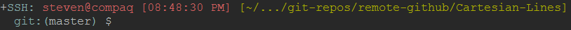

# Dotfiles

### Colourschemes

Links for these colourschemes are at the bottom with the list of vim plugins.

#### Gruvbox Colourscheme


#### Iceberg Colourscheme


#### Badwolf Colourscheme


  This is a repo of the dot files that I use and have modifications for.

### Usage
  To use everything in this repo, just run the following command:

#### Initial Setup

Note that git needs to be installed in order to do this setup. Install git with:

```bash
sudo apt-get install git
```

Then do these for the initial setup:

```bash
$ mkdir Documents/git-repos/remote-github
$ cd Documents/git-repos-remote-github
# --recursive will also get git-radar as a submodule
$ git clone --recursive https://github.com/hallzy/dotfiles.git
$ dotfiles/sym-link-files-to-home
$ cd ~
$ .auto-install-programs/install-programs

$ # Optional
$ .auto-clone/clone-repos
$ ./update-all-repos

$ ./create-sym-links-for-myscripts
$ custom-fortunes/install-quote

$ ./setup-latex-resume-font
```

The steps that are optional are optional because it is not necessary to clone
the repos. The repos that are used to update the Vim plugins will be updated
with a git pull anyways, since I will maintain that myself.

This will clone the repository and will symlink important files from that
repository to your home folder.

The 6th entry will install all the programs in the
.auto-install-programs/programs-to-install file.

The 7th entry will automatically clone all of the repos that I use or own.

The 8th Entry will pull new changes from all the repos that were cloned in the
previous step, including this repo. It will also run the symlink script from
before, and copy all files related to Vim to your Vim folder.

The 9th step runs a script that creates symbolic links in your /bin
folder for scripts that are in ~/.my-scripts.

The 10th step will add the files in the categories sub folder to the fortunes
game program.

The 11th step will put the fonts in all the right places to use the latex resume.


### .vim and .vimrc
  This includes my .vimrc file which is a heavily  modified version of the .vimrc
file from [mscoutermarsh](https://github.com/mscoutermarsh)

  I also recommend remapping the caps lock key to <esc>, since the escape key is
used quite frequently using vim, or remembering that ctrl+\[ is is recognized
as the escape key (this may be a better option for virtual machines, or windows
users as remapping keys in windows or with a virtual machine is a little
annoying. Remapping keys in Ubuntu for example, is much easier).

### Neovim

Is installed by the install script. It uses the same rc file as vim (.vimrc).

To setup neovim, do this one time:

```bash
$ mkdir -p ${XDG_CONFIG_HOME:=$HOME/.config}
$ ln -s ~/.vim $XDG_CONFIG_HOME/nvim
$ ln -s ~/.vimrc $XDG_CONFIG_HOME/nvim/init.vim
```

This will setup the location for nvim files and the rc file, and will symlink
these to the corresponding files in vim.

### .bashrc
  My .bashrc started as the default that came with Ubuntu, and still has most of
the original stuff. I have added a few things though, which I will make note of
here:
  * I have a sendtext command which uses an external service and the curl program to send a text message.
  * I have a downloadMusic command which uses youtube-dl to download audio of Youtube videos
  * Environment Variables for the location of my REPOS directories, and my
    dotfiles repo ($REPOS and $dotfiles respectively)
  * crtime() function that find the creation time of a file
  * MAIL environment variable for my mail

All other changes I have made affect the prompt:
  * I changed the default prompt to not show the current directory
  * Added a part that adds the current time in 12-hour clock
  * Prefixed my prompt with "SSH:" If the console is being used in an ssh
    session.
  * Appended the prompt so that it shows the 3 parent directories of the cwd.
  * Added git radar.

The colours of the prompt are taken straight from the palette of gruvbox, so it
has a similar look to it. The only thing I can't change using the bashrc is the
terminal background and text colour.

####Background

The equivalent colour for what I am using is dark0 which
has a hex value of "#282828", and an r-g-b value of "40-40-40". The value to use
in bashrc is "235".

####Text

has a hex value of "#BBBBBB", and an r-g-b value of "187-187-187".


The following is what my prompt looks like now (if the session is not an ssh
session, then it will look the same, but without the ssh part):




The above example is in an ssh session, in a git repo so git-radar is displayed
as well... The cwd is in a bright green colour, and the "SSH:" and "git:(" are
in cyan (note that the git:( is only cyan in an SSH session. Otherwise it is the
default grey. The problem is that with Putty the grey appears as black so I
cannot see it. The cyan is easily readable, and is a reminder I am in an ssh
session).

An example use of the text message function is below.

```bash
$ sendtext 1234567890 "My message."
```

Would send the message "My message." To 1234567890, if that were a real number.
The person to whom you sent this text to cannot reply however.

An example use of the downloadMusic function is below:

```bash
downloadMusic $FILENAME $URL
```

Where $FILENAME is the name to save the file as, and $URL is the youtube
URL.

### .bash_aliases
  Has my aliases which include the use of the trash bin:

```bash
$ trash
$ trash-ls
$ trash-restore
```

You can:

1. Move a file to the trash bin
2. View the contents of the trash bin.
3. Restore files to there original location from the trash bin

Respectively. The first two are aliases in the .bashrc, the 3rd one is a script
in the .my-scripts directory which I moved to my /bin.

### .myscripts/
  It may be worth creating symbolic links for these scripts in /bin, for easy
use, and some of the instructions here assume that they are in /bin.

  This holds some scripts I have. The Update script is used by the script in the
.gnome2/ directory.

  It also has _open-nautilus_ which, when executed from the terminal, opens the
nautilus file manager at the current location in the terminal.

  trash-restore restores a given file back to its original location after it has
been moved to the trash.

### .gnome2/
  This holds my nautilus scripts, which are scripts that populate the right
click context menu.
  * Update updates my Ubuntu system as the Update manager does, but in terminal.
  * Open Terminal Here: Opens a terminal with the cwd as the place in the file
    system that you right clicked. ie) if you right click on the desktop and run
this script, it will start a terminal at ~/Desktop/

### .gitconfig
  My .gitconfig file that has some settings such as aliases, and default editor
for commits.

### .netrc

This file is used for vim-rhubarb. It requires the password and username for
github. The username and password should be populated in this file, and copied
to ~/.netrc

Note, that the password in this file is not actually my password :)

### .auto-install-programs
  This folder contains bash scripts that will automatically install all the
programs specified in the programs-to-install file. To use this:

```bash
$ cd ~/.auto-install-programs
$ ./install-programs
```

  Assuming that your list of programs to install is up to date. If you do not
already have a log folder within this folder, it will create one for you, and
create timestamped logs within this folder.

  This script will use the helper script to help make it run as intended. It
will automatically run

```bash
$ sudo add-apt-repository <repo>
```

```bash
$ sudo apt-get update
```

And

```bash
$ sudo apt-get <program>
```

Where \<program\> is every program listed in the programs-to-install file. A
summary will be shown at the end saying which of the scripts had successfully
been installed, and which scripts did not.

The script automatically enters a "y" for you when apt-get prompts you to see if
you want to install something.

There is also an option to get the script to email you when it is finished...

```bash
$ ./install-programs --email me@email.com
```

Note that mailutils needs to be installed to do this. It is part of the
programs-to-install file, but it will not be used if it was not already
installed beforehand.

There are 3 files that hold programs or repos to install.

  * programs-to-install-require-user-interaction
  * programs-to-install
  * repos-to-add

The first holds all the programs that require extra user input upon install.
These programs are installed first so that you are able to leave the script
running after they are installed. The script will pause and let you know that
this section of the script is done.

The second is all the regular programs that can be installed without user input.

The last are a list of repositories that you may want added.

There is also a section at the bottom of install-programs-helper for programs
that need a more specific installation.

### latex-resume

The latex-resume directory holds my files for my resume that is written in
LaTeX. The resume template is courtesy of @afriggeri, with some modifications
including using a different font.

In order to use this template yourself:

```bash
$ cd ~
$ .auto-install-programs/install-programs
$ ./setup-latex-resume-font
$ cd latex-resume
$ make
```

The install-programs script will ensure that you have installed the latest
version of texlive-full.

By just cloning this repository you will have all the fonts necessary to build
the resume. The setup-latex-resume-font will move 3 files into a LaTeX related
folder that will prevent errors during a build.

Running "make" will start the build of the resume.

### Mutt

Mutt is a email client that I use. There are several dot files in this repo that
are used to help configure it.

Some of the dotfiles require a password to use. Those are:
  * .muttrc
  * .msmtprc

In the .msmtp file, there is a line:

```bash
passwordeval cat ~/.mutt/msmtp-password
```
That gets the password from an external file. This file only contains the
password, and nothing else (No assignments etc). It would be better to have this
file encrypted and change "cat" with a gpg command that decrypts the file, but I
have not gotten around to doing this yet.

In the .muttrc file there is a line:

```bash
source "~/.mutt/passwords"
```

Which contains:

```bash
set imap_pass = "PASSWORD"
```

Where PASSWORD is your password. Again, the source command could use gpg to
decrypt the file, but mine is not yet encrypted.

These password files are not included in this repository (and never will be) for
obvious reasons.

##### Mutt Setup

Pull the changes and ensure that the config files are in ~/

Note that the symlink-files-to-home script will do this.

Add the password files to ~/.mutt/ as described under the "Mutt" section (could
be put anywhere and called anything, just make sure to change the rc files
accordingly. Alternatively, you can just put your password in the rc files in
plain text. See [this web page](https://help.ubuntu.com/community/MuttAndGmail)
for an example rc file with the password (note that this is the page that I used
to get this all working, along with a few added things, so this is a good place
to start if you have problems).

Ensure that the permissions of .fetchmailrc are 600 (The max allowed apparently
is 700, and if there are more permissions allowed than that, it will complain...
May as well use 600 because it should not have execute permission anyways).

Run the fetchmail program (if you did not provide your login password for your
email, fetchmail will ask you for it... Enter the password):

```bash
$ fetchmail -v
```

This will populate /var/spool/mail/USER and make it a mailbox.

Start mutt:

```bash
$ mutt
```

It will probably tell you that you do not have a ~/Mail directory and it will
ask you if you want to create one. Say yes.

Mutt should now open

# Pre-installed vim Plugins
I use [vim-plug](https://github.com/junegunn/vim-plug) to manage my plugins:

Plugins that I have:

[a.vim][]
[auto-pairs][]
[badwolf Colourscheme][]
[badwolf lightline theme][]
[conque gdb][]
[cscope.vim][]
[detectindent][]
[dragvisuals][]
[git-time-lapse][]
[gruvbox Colourscheme][]
[iceberg Colourscheme][]
[iceberg lightline theme][]
[indentline][]
[lightline.vim][]
[mru][]
[nerdtree][]
[numbers.vim][]
[onedark lightline theme][]
[quick-scope][]
[replacewithregister][]
[snipmate][]
[syntastic][]
[tabular][]
[taghighlight][]
[unite.vim][]
[vim-abolish][]
[vim-argumentative][]
[vim-autoswap][]
[vim-commentary][]
[vim-easy-align][]
[vim-easymotion][]
[vim-endwise][]
[vim-fanfingtastic][]
[vim-fugitive][]
[vim-gitgutter][]
[vim-gnupg][]
[vim-instant-markdown][]
[vim-lengthmatters][]
[vim-markdown][]
[vim-misc][]  - A dependancy of vim-session
[vim-multiple-cursors][]
[vim-notes][]
[vim-over][]
[vim-repeat][]  - Currently I only use this to support vim-fanfingtastic
[vim-rhubarb][]  - copy netrc file to ~/.netrc and add login info for this plugin
[vim-session][]
[vim-signature][]
[vim-sort-motion][]
[vim-startify][]
[vim-surround][]
[vim-swap][]
[vim-table-mode][]
[vim-textobj-function][]
[vim-textobj-indent][]
[vim-textobj-user][]
[vim-visualMarks][]
[vimShell][]
[vimlint][]  - Dependancy of syntastic for vimL
[vimlparser][]  - Dependancy of syntastic for vimL
[vimproc][]  - Dependancy of Unite.vim and VimShell- need to run install command
[vissort][]
[vmath.vim][]
[youcompleteme][]  - See the repo for installation instructions. Compilation is required

[a.vim]: https://github.com/vim-scripts/a.vim
[auto-pairs]: https://github.com/jiangmiao/auto-pairs
[badwolf Colourscheme]: https://github.com/sjl/badwolf
[badwolf lightline theme]: https://github.com/844196/lightline-badwolf.vim
[conque gdb]: https://github.com/vim-scripts/Conque-GDB
[cscope.vim]: https://github.com/brookhong/cscope.vim
[detectindent]: https://github.com/ciaranm/detectindent
[dragvisuals]: https://github.com/gavinbeatty/dragvisuals.vim
[git-time-lapse]: https://github.com/vim-scripts/git-time-lapse
[gruvbox Colourscheme]: https://github.com/morhetz/gruvbox
[iceberg Colourscheme]: https://github.com/cocopon/iceberg.vim
[iceberg lightline theme]: https://github.com/halllzy/lightline-iceberg
[indentline]: https://github.com/Yggdroot/indentLine
[lightline.vim]: https://github.com/itchyny/lightline.vim
[mru]: https://github.com/vim-scripts/mru.vim
[nerdtree]: https://github.com/scrooloose/nerdtree
[numbers.vim]: https://github.com/myusuf3/numbers.vim.git
[onedark lightline theme]: https://github.com/halllzy/lightline-onedark
[quick-scope]: https://github.com/unblevable/quick-scope
[replacewithregister]: https://github.com/vim-scripts/ReplaceWithRegister
[snipmate]: https://github.com/msanders/snipmate.vim
[syntastic]: https://github.com/scrooloose/syntastic
[tabular]: https://github.com/godlygeek/tabular
[taghighlight]: https://github.com/abudden/taghighlight-automirror
[unite.vim]: https://github.com/Shougo/unite.vim
[vim-abolish]: https://github.com/tpope/vim-abolish
[vim-argumentative]: https://github.com/PeterRincker/vim-argumentative
[vim-autoswap]: https://github.com/gioele/vim-autoswap
[vim-commentary]: https://github.com/tpope/vim-commentary
[vim-easy-align]: https://github.com/junegunn/vim-easy-align
[vim-easymotion]: https://github.com/Lokaltog/vim-easymotion
[vim-endwise]: https:github.com/tpope/vim-endwise
[vim-fanfingtastic]: https://github.com/dahu/vim-fanfingtastic
[vim-fugitive]: https://github.com/tpope/vim-fugitive
[vim-gitgutter]: https://github.com/airblade/vim-gitgutter
[vim-gnupg]: jamessan/vim-gnupg
[vim-instant-markdown]: https://github.com/suan/vim-instant-markdown
[vim-lengthmatters]: https://github.com/whatyouhide/vim-lengthmatters
[vim-markdown]: https://github.com/plasticboy/vim-markdown
[vim-misc]: https://github.com/xolox/vim-misc.git
[vim-multiple-cursors]: https://github.com/terryma/vim-multiple-cursors
[vim-notes]: https://github.com/xolox/vim-notes
[vim-over]: https://github.com/osyo-manga/vim-over
[vim-repeat]: https://github.com/tpope/vim-repeat
[vim-rhubarb]: https://github.com/tpope/vim-rhubarb
[vim-session]: https://github.com/xolox/vim-session.git
[vim-signature]: https://github.com/kshenoy/vim-signature
[vim-sort-motion]: https://github.com/christoomey/vim-sort-motion
[vim-startify]: https://github.com/mhinz/vim-startify
[vim-surround]: https://github.com/tpope/vim-surround
[vim-swap]: https://github.com/kurkale6ka/vim-swap
[vim-table-mode]: https://github.com/dhruvasagar/vim-table-mode
[vim-textobj-function]: https://github.com/kana/vim-textobj-function
[vim-textobj-indent]: https://github.com/kana/vim-textobj-indent
[vim-textobj-user]: https://github.com/kana/vim-textobj-user
[vim-visualMarks]: https://github.com/iago-lito/vim-visualMarks
[vimShell]: https://github.com/Shougo/vimshell.vim
[vimlint]: https://github.com/syngan/vim-vimlint
[vimlparser]: https://github.com/ynkdir/vim-vidlparser
[vimproc]: https://github.com/Shougo/vimproc.vim
[vissort]: https://github.com/yaroot/vissort
[vmath.vim]: https://github.com/gavinbeatty/vmath.vim
[youcompleteme]: https://github.com/Valloric/YouCompleteMe

Notes:

My leader is the spacebar.

My easy motion \<leader\> is \<leader\>b

This can be changed within the vimrc file.

